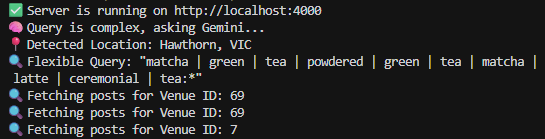
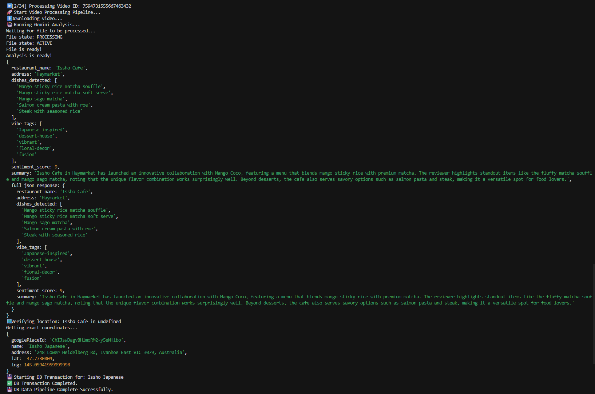

# 🍱 Reel Food Places

**Try the App:** [https://reelfoodplaces.vercel.app/](https://reelfoodplaces.vercel.app/)

> **A viral food discovery engine powered by AI, Vectors, and Reels.**


## 📖 About The Project


**Reel Food Places** is a full-stack application that bridges the gap between viral social media food content and actionable discovery. Instead of saving TikTok videos to a "Must Try" folder that you never look at again, this app visualizes them on an interactive map.

> **⚠️ Note on Data Availability:**
> This application relies on a custom-scraped dataset of viral food videos. Currently, the dataset **only covers Melbourne and Sydney, Australia**. Searching for locations outside these cities will not yield results.

It consists of two core systems:
1.  **The Scraper Engine:** Automatically aggregates, analyzes, and extracts location data from viral food videos.
2.  **The Search Engine:** An intelligent retrieval system that uses **Google Gemini** to understand natural language queries (e.g., *"Matcha places in Hawthorn"*) and performs hybrid search against a **Supabase** database.

---

## ⚡ Tech Stack

### **Frontend**
* **Framework:** React (Vite) + TypeScript
* **Styling:** Tailwind CSS (Custom animations & "Space Mono" aesthetic)
* **Maps:** Mapbox GL JS + Mapbox Geocoder
* **State:** React Hooks (Custom location synchronization)

### **Backend & Data**
* **Server:** Node.js + Express
* **Database:** Supabase (PostgreSQL)
* **Search Logic:** Intelligent Full-Text Search (PostgreSQL `tsvector`)
* **AI Integration:** Google Gemini 3 Flash (Query parsing & Intent detection)
* **Data Access:** Supabase JS Client (`@supabase/supabase-js`)

### **DevOps**
* **Frontend Deployment:** Vercel
* **Backend Deployment:** Railway

---

## 🧠 The "Intelligent" Search Engine

Unlike standard keyword searches, this project uses a multi-step AI pipeline to understand user intent.




1.  **Input Analysis:** The user types a query (e.g., *"Cozy cafes for study near CBD"*).
2.  **Gemini Parsing:** The backend sends this to Google Gemini, which extracts:
    * **Keywords:** `["cafe", "coffee", "study", "quiet"]`
    * **Location:** `"Melbourne CBD"`
    * **Vibe/Category:** `"Cozy"`
3.  **Smart SQL Generation:** The system converts these AI outputs into a complex PostgreSQL `tsquery` with flexible logic (e.g., `(cafe | coffee) & (quiet | study)`).
4.  **Location Biasing:** If a location is detected, the map automatically "flies" to that suburb coordinates while filtering results within that radius.

---

## 🕷️ The Scraper (Data Pipeline)



The project includes a custom scraper designed to populate the database with high-quality content.

* **Extraction:** Parses social media video metadata to identify restaurant names and addresses.
* **Enrichment:** Uses Geocoding APIs to convert raw addresses into `Latitude/Longitude` coordinates.
* **Vibe Analysis:** Analyzes captions and comments to tag venues with "vibes" (e.g., *Date Night, Cheap Eats, Hidden Gem*) for better searchability.

---

## 🚀 Getting Started

### Prerequisites
* Node.js (v18+)
* Supabase Account
* Mapbox API Token
* Google Gemini API Key

### 1. Clone the Repo
```
git clone [https://github.com/yourusername/reel-food-places.git](https://github.com/yourusername/reel-food-places.git)
cd reel-food-places
```

### 2. Database Setup (Supabase)

Before running the app, you need to set up the database schema and search functions.

1.  **Create a new Project** on [Supabase](https://supabase.com/).
2.  Go to the **SQL Editor** in the left sidebar.
3.  **Run the Schema:**
    * Open `supabase/schema.sql` from this repository.
    * Paste the content into the SQL Editor and click **Run**.
    * *This creates the tables (`venues`, `social_posts`, `ai_insights`) and enables PostGIS.*
4.  **Run the Functions:**
    * Open `supabase/functions.sql`.
    * Paste the content into the SQL Editor and click **Run**.
    * *This enables the AI search logic, vector extensions, and performance indexes.*

### 3. Backend Setup
```
cd backend
npm install

# Create a .env file
echo "PORT=4000" >> .env
echo "SUPABASE_URL=your_supabase_url" >> .env
echo "SUPABASE_KEY=your_supabase_anon_key" >> .env
echo "GEMINI_API_KEY=your_google_ai_key" >> .env
echo "MAPBOX_ACCESS_TOKEN=your_mapbox_token" >> .env

# Start Server
npm run dev
```

### 4. Frontend Setup
```
cd frontend
npm install

# Create a .env file
echo "VITE_API_URL=http://localhost:4000" >> .env
echo "VITE_MAPBOX_ACCESS_TOKEN=your_mapbox_token" >> .env

# Start Client
npm run dev
```


---
## 🤝 Contributing

Contributions are what make the open source community such an amazing place to learn, inspire, and create. Any contributions you make are **greatly appreciated**.

1.  Fork the Project
2.  Create your Feature Branch (`git checkout -b feature/AmazingFeature`)
3.  Commit your Changes (`git commit -m 'Add some AmazingFeature'`)
4.  Push to the Branch (`git push origin feature/AmazingFeature`)
5.  Open a Pull Request

---

## 📝 License

Distributed under the MIT License. See `LICENSE` for more information.

---

**Built with 🧡 and too much Matcha in Melbourne.**